<p align="center"><strong>用 C 构建的 CPU 三维渲染引擎</strong></p>
<p align="center">光栅化 · 光线追踪 · 材质与光照 · 可配置索引 · 独立静态库</p>

<p align="center">
  <a href="#渲染效果">效果画廊</a> ·
  <a href="#场景编辑与贴图创作">编辑工具</a> ·
  <a href="#快速开始">快速开始</a> ·
  <a href="sdk/MANUAL.md">使用手册</a> ·
  <a href="releases/">预编译 SDK</a> ·
  <a href="Demo/README.md">Demo 导航</a> ·
  <a href="tests/README.md">测试与验收</a> ·
  <a href="README.en.md">English</a>
</p>

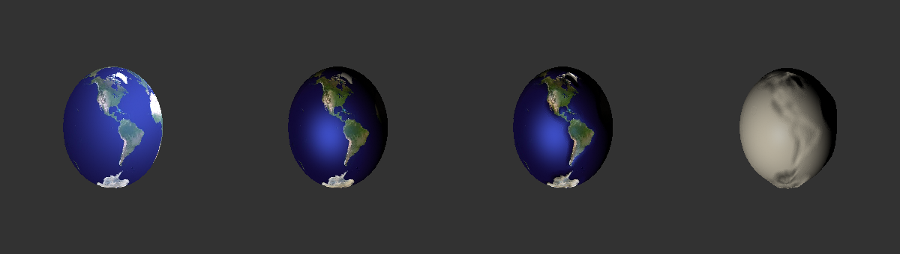

<p align="center">从左到右：基础纹理 → 受光表面 → 法线细节 → 高度置换。全部由 CPU 渲染。</p>

YMGRE 从顶点变换、视锥裁剪、三角形填充和深度缓冲出发，逐步实现纹理采样、逐顶点/逐像素光照，以及基于射线求交的阴影、反射与折射。
核心使用 C99，通过颜色缓冲和深度缓冲输出结果，可接入桌面窗口或自有 LCD 显示层。

项目同时提供**可直接链接的静态库、使用手册和独立 Demo**。日常开发可以围绕公开头文件使用库；需要扩展或定位问题时再进入引擎实现。

| 渲染 | 创作 | 集成 |
|:---:|:---:|:---:|
| **光栅化 + 光线追踪**<br>纹理、光照、阴影、反射与折射 | **场景 + UV + 画板 + 烘焙**<br>从网格到可导出的材质资源 | **C99 + 双索引静态库**<br>公开头文件、手册与 30 个 SDK 示例 |

## 渲染效果

下面的图片均来自本仓库 Demo 的真实渲染输出，截图仅做图片格式转换。

### Girl 人物材质

| 半身效果 | 脸部近景 |
|:---:|:---:|
| 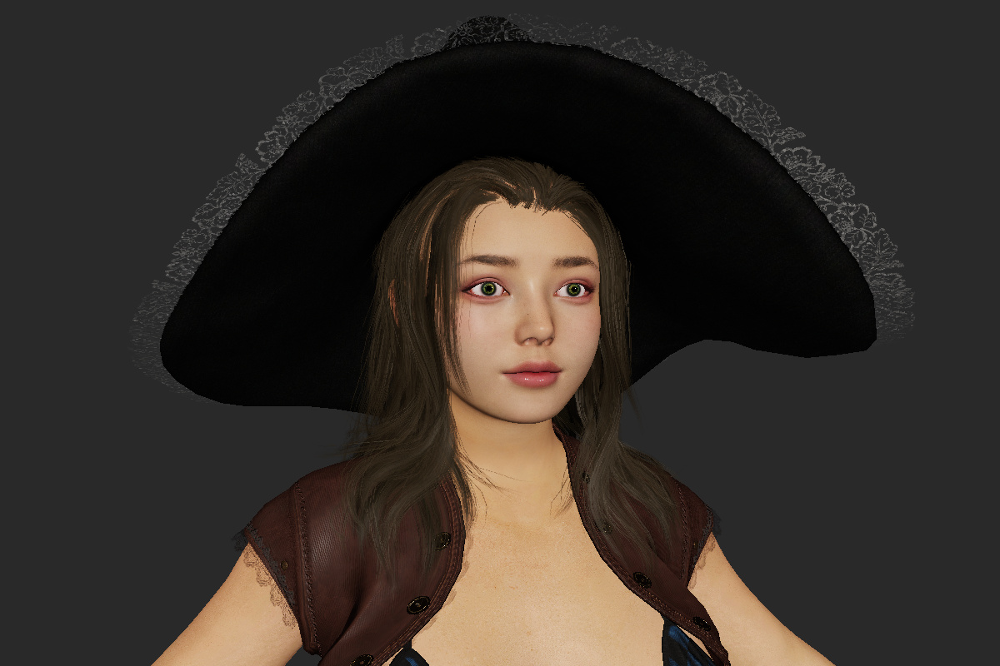 |  |

`girl_viewer` 使用 CPU 光栅化、逐像素 GGX、法线贴图、透明发丝及 Mip、线性色彩和曝光。以上是当前 `Resource/girl` 资源的实际画面；此示例未启用阴影或光追。运行 `./project_Demo/girl_viewer/build.sh --run` 打开，详见 [Girl 示例说明](project_Demo/girl_viewer/README.md)。

### 反射、折射与贴图

| 镜面反射 | 玻璃折射 |
|:---:|:---:|
| 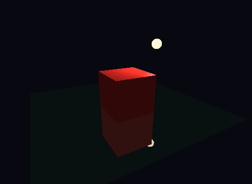 | 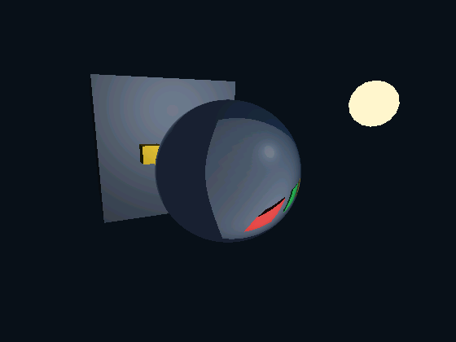 |
| 反射射线命中场景，显示物体和光源倒影 | 解析球体的入射/出射折射与表面高光 |

| 透视贴图 | 法线贴图 |
|:---:|:---:|
|  | 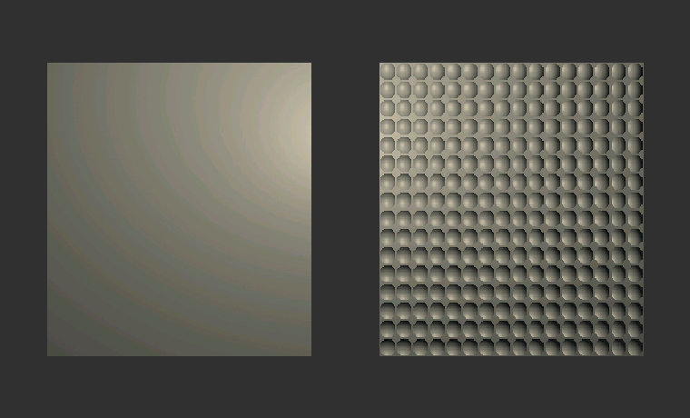 |
| 倾斜平面的纹理与深度按透视关系插值 | 同一平面使用不同法线，改变受光细节 |

### 光线遮挡与几何结构

| 光追阴影 | 基础网格 |
|:---:|:---:|
| 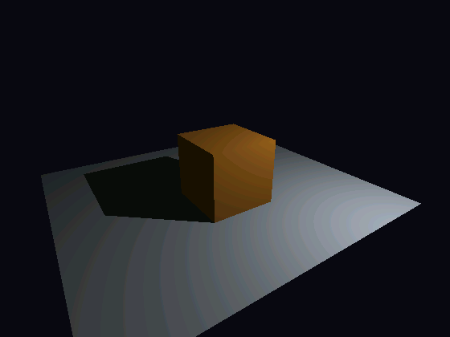 | 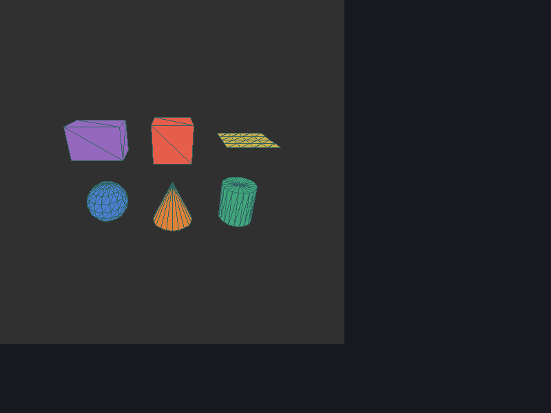 |
| 从表面向光源发射射线，判断是否被其他物体遮挡 | 生成几何、观察拓扑，检查填充与线框的遮挡关系 |

<details>
<summary><strong>更多几何：圆环、胶囊、多面体，以及网格／解析球面对照</strong></summary>


球体既可以按三角网格求交，也可以在光追中使用解析曲面。下面是同一演示场景的对照；解析球面直接计算交点与法线。

| 三角网格球体 | 解析球面 |
|:---:|:---:|
|  | 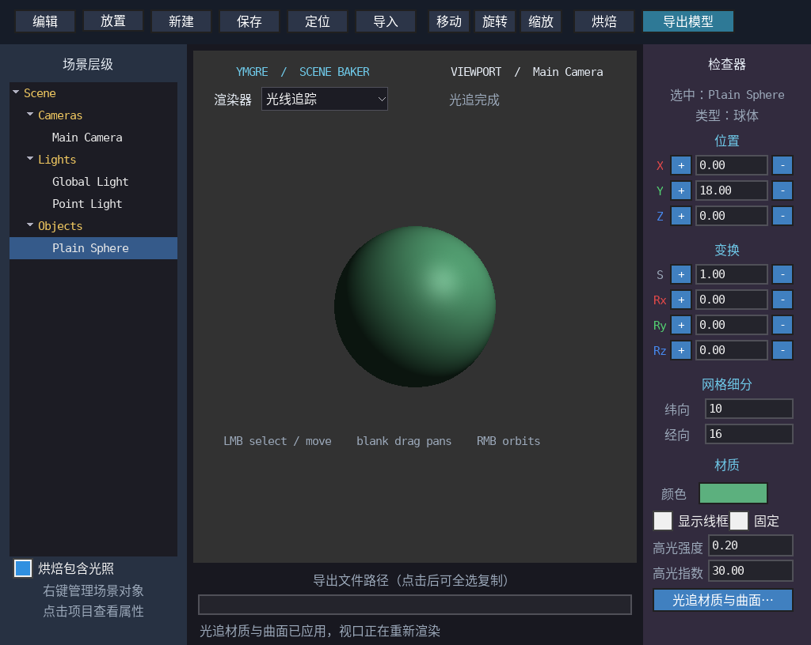 |

</details>

## 场景编辑与贴图创作

**摆放模型、调整材质和光源，再进入 UV 与贴图编辑。** 场景层级、三维视口和属性检查器组成完整的编辑界面；`scene_baker` 还提供光栅化／光追切换与模型导出。

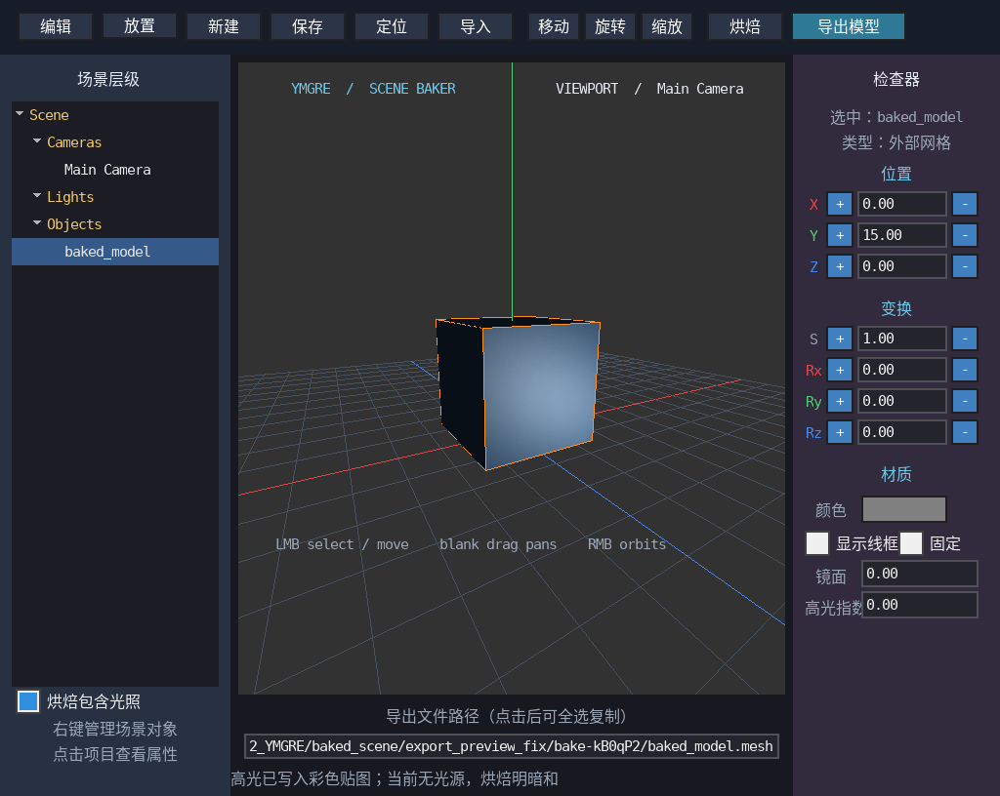

### UV 展开与模型预览

| 导入模型的原始 UV | 基本形状的自动展开 |
|:---:|:---:|
| 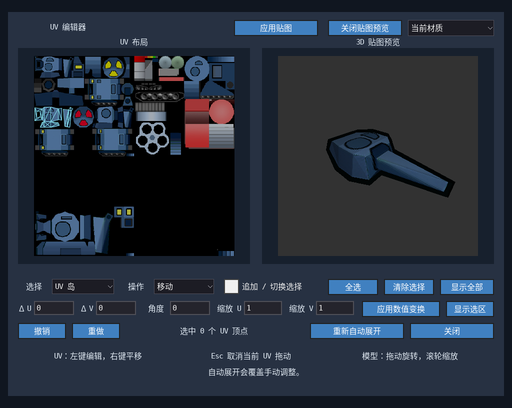 | 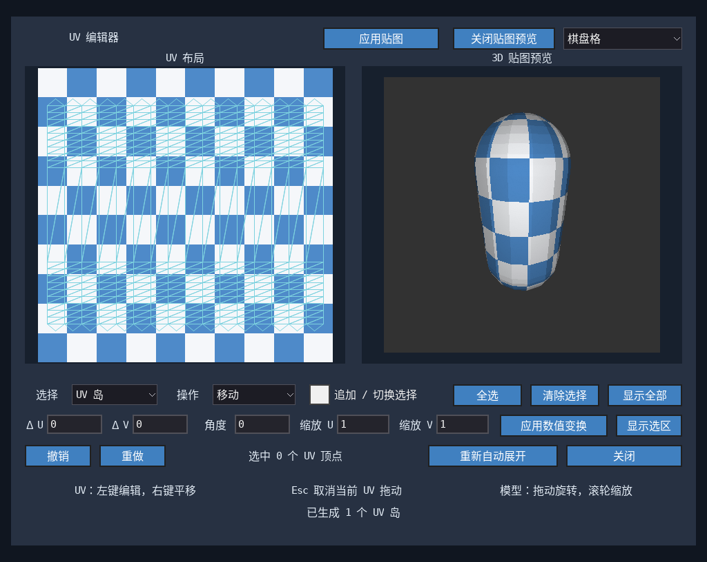 |
| 坦克头模型：左侧检查 UV 与贴图，右侧查看模型上的实际效果 | 胶囊体：展开后用棋盘格观察纹理方向与拉伸 |

可选择 UV 顶点、三角形或 UV 岛，执行移动、旋转、缩放及数值变换，支持撤销／重做。修改后直接预览，点击“应用贴图”即可用于场景。

### 在画板里创作，在模型上检查

| 图层画板 | 贴回三维模型 |
|:---:|:---:|
| 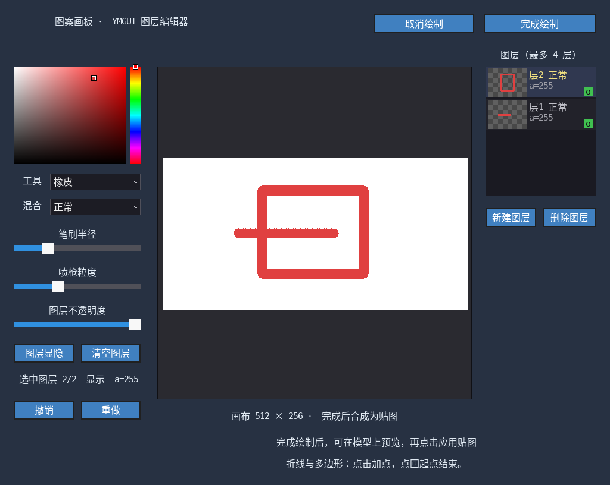 | 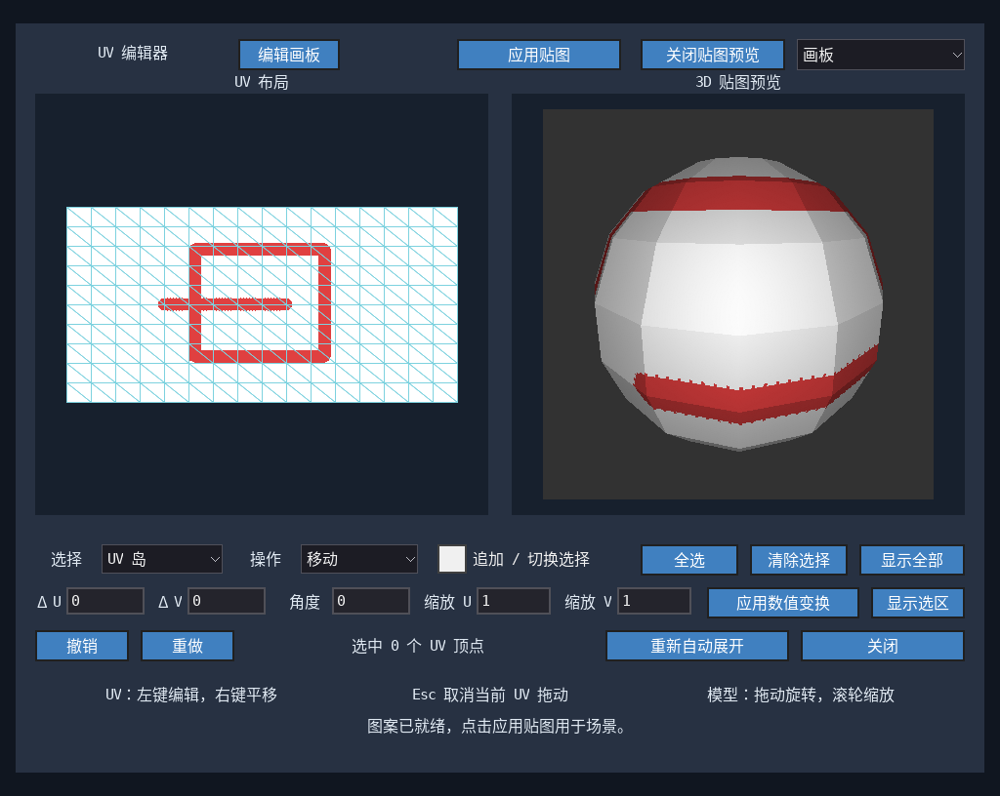 |
| 调整颜色、笔刷、图层与不透明度，完成后合成为贴图 | 在 UV 布局与模型间核对图案的位置、接缝和变形 |

贴图来源支持原材质、棋盘格、画板与导入图像。画板界面由 YMGUI 提供，三维预览由 YMGRE 渲染。

### 烘焙并导出可复用资源

| 烘焙前：场景实时光照 | 导出后：无灯光预览 |
|:---:|:---:|
|  | 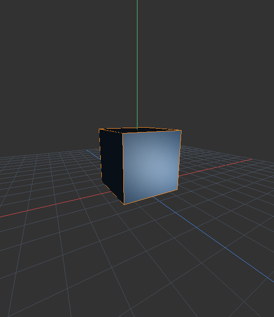 |
| 根据当前材质、灯光和视角计算表面颜色 | 明暗与参考视角的高光已写入彩色贴图 |

烘焙可选择是否包含光照。统一的“导出模型”入口会在结果有效时导出烘焙成品，否则导出正常模型与材质。成品包含 `.mesh`、`.material` 和 BMP 贴图，可再次导入使用。

含光照烘焙会固定参考视角的高光；当前不包含间接光和遮挡阴影烘焙。完整流程与范围见 [scene_baker 使用说明](project_Demo/scene_baker/README.md)。

上述工具属于仓库中的应用项目，独立静态库包提供底层渲染与资源接口。图片来自实际 Demo 和已有编辑器验收画面；来源、配置及复现方式见 [图片说明](docs/images/README.md)。点击图片可查看原始尺寸。

## 能做什么

| 模块 | 已有能力 |
|---|---|
| 几何 | 平面、立方体、球体、圆柱、圆锥、圆环、胶囊体及规则多面体；多边形三角化 |
| 光栅管线 | 坐标变换、背面剔除、视锥/窗口裁剪、三角形与多边形填充、深度与线框 |
| 材质 | UV 纹理、顶点色、法线贴图、高光通道、高度置换、已有光照贴图的采样 |
| 光照 | 环境光、点光源、聚光灯；逐面、逐顶点、逐像素三种采样方式 |
| 光线追踪 | 网格、球体、平面、AABB、圆柱求交；着色、反射、折射和 Fresnel 函数 |
| 资源与场景 | 静态 Ogre 网格/材质读取、BMP 图像、物体/材质/光源/相机管理 |
| 输出与内存 | RGB565 / RGB888 源码及 SDK 配置；外部帧缓冲、独立或共享渲染工作区 |
| 索引配置 | 公共类型 `GRE_Index`，编译时选择 `uint16` 或 `uint32` |

**MCU 可以保留基础管线和 16 位索引，PC 可以选择高级材质及更大的网格。** 实际性能和可用规模取决于硬件、分辨率、模型和所选算法；本机静态库不能直接用于不同架构的 MCU。

## 快速开始

### 直接使用预编译 SDK

从 [releases 分发目录](releases/README.md) 下载压缩包并解压，也可以取得整个 [build/YMGRE_libs](build/YMGRE_libs/) 目录。
在 SDK 目录运行：

```sh
./build_demos.sh 16 --depth 16  # RGB565 / index16
./build_demos.sh 32 --depth 16  # RGB565 / index32
./build_demos.sh 16 --depth 24  # RGB888 / index16
./build_demos.sh 32 --depth 24  # RGB888 / index32
```

默认构建无窗口示例，不需要引擎源码、YMGUI 或 SDL。示例会生成 `cube.ppm`，并输出索引大小、像素大小和有效像素数量。

目前发布包为 **Linux x86_64 / Release / RGB565 + RGB888**，每种色深均提供两种索引位宽，共四种组合；具体编译器和配置记录在 `BUILD_INFO.json`。

### 在自己的工程中链接

```cmake
cmake_minimum_required(VERSION 3.16)
project(my_demo C)
set(CMAKE_C_STANDARD 99)

find_package(YMGRE CONFIG REQUIRED)
add_executable(my_demo main.c)
target_link_libraries(my_demo PRIVATE YMGRE::ymgre)
```

```sh
cmake -S . -B build16 \
  -DYMGRE_DIR=/absolute/path/YMGRE_libs/cmake \
  -DYMGRE_INDEX_BITS=16 -DYMGRE_CAMERA_COLOR_DEPTH=16
cmake --build build16
```

`YMGRE::ymgre` 自动传递匹配的头文件路径、索引位宽、像素格式和数学库依赖。
完整可编译入口见 [最小示例](sdk/examples/demo_sdk_minimal.c)，相机、材质、内存所有权及调用顺序见 [使用手册](sdk/MANUAL.md)。

### 运行窗口 Demo

YMGRE 与 YMGUI **分别发布、分别维护**。YMGRE 包不包含 YMGUI 的头文件、静态库或嵌入 YMGUI 的窗口程序。
窗口 Demo 保留源码，显式接入外部 YMGUI SDK：

```sh
./build_demos.sh 16 /absolute/path/YMGUI_libs/cmake
./examples-build/rgb565/index16/bin/demo_basic_shapes
./examples-build/rgb565/index16/bin/demo_advanced_raytrace_mirror
```

外部 YMGUI 包需提供兼容的 CMake 目标和对应色深配置；接入接口的详细约定见 [手册第 5 节](sdk/MANUAL.md#5-重新编译整套示例)。
源码仓库中的 Demo 可直接使用仓库内的 YMGUI 子模块构建。

## 一键编译与发布

维护引擎时，在本仓库执行：

```sh
./sdk/build.sh             # 本地 SDK 与压缩包
./sdk/build.sh --release   # 验证后更新 releases/ 分发包
```

脚本编译四份核心库、复制头文件和示例、验证独立链接，然后生成 SDK、压缩包及 SHA256 校验文件：

```text
build/
├── YMGRE_libs/
│   ├── include/YMGRE/        # 公开头文件
│   ├── lib/                  # RGB565/RGB888 × index16/index32 四份静态库
│   ├── cmake/                # find_package 接入配置
│   ├── examples/             # 30 个 Demo 源码与应用侧窗口接入代码
│   ├── bin/                  # 已编译的无窗口示例
│   ├── docs/images/          # 随包携带的效果图
│   ├── build_demos.sh
│   ├── README.md
│   └── 手册.md
├── bin/<色深>/<索引宽度>/    # 所有 Demo 和应用的可执行文件
├── archives/                # 本地压缩包及 SHA256 文件
└── .cache/                  # 可重建的构建缓存与过程日志
```

默认发布流程不需要 YMGUI。提供外部包时，可以额外验收全部窗口 Demo：

```sh
./sdk/build.sh --ymgui-dir /absolute/path/YMGUI_libs/cmake
```

`--release` 将压缩包和 SHA256 文件写入可提交的 `releases/`；普通构建不会修改该目录。脚本在临时目录组装 SDK，构建或验收失败会保留已有 SDK 和分发包。可用 `--jobs 8` 调整并行度。

`build/YMGRE_libs/` 的现有 Git 放行规则继续保留，其他构建输出仍忽略。发布日志在 `build/.cache/sdk/`。详见 [分发说明](releases/README.md)；脚本不会自动提交或推送。

## 从源码构建

日常入口：`./project_Demo/girl_viewer/build.sh --run` 打开人物示例，`./sdk/build.sh` 生成 SDK。所有 Demo 程序位于 `build/bin/<色深>/<索引宽度>/`，SDK 位于 `build/YMGRE_libs/`，中间文件统一放在 `build/.cache/`。详见 [构建入口与目录](docs/BUILD_LAYOUT.md)。

桌面 Demo 需要 C 编译器、CMake、pkg-config、SDL2 开发包，以及仓库的 YMGUI 子模块。

```sh
git submodule update --init --recursive
cmake -S . -B build/.cache/configs/rgb888/index16/Demo \
  -DYMGRE_INDEX_BITS=16 \
  -DYMGRE_CAMERA_COLOR_DEPTH=24
cmake --build build/.cache/configs/rgb888/index16/Demo -j4
ctest --test-dir build/.cache/configs/rgb888/index16/Demo --output-on-failure
./build/bin/rgb888/index16/demo_basic_shapes
```

一键构建核心、基础 Demo 和所有独立应用：

```sh
./build_all.sh -t
./build_all.sh --depth 16 --index-bits 32 -t
```

默认 RGB888 / 16 位索引，产物按色深和索引宽度隔离；RGB565 会明确跳过目前要求 RGB888 的烘焙器。应用额外依赖及完整命令见 [构建目录说明](docs/BUILD_LAYOUT.md)。

只构建核心和模块测试时，可以关闭桌面显示依赖：

```sh
./build_all.sh --core-only -t
```

索引位宽和颜色格式属于编译配置。库与应用的所有编译单元必须保持一致，切换后重新编译；不要把不同配置的库混到同一个程序中。

## Demo 与应用入口

| 想看什么 | 从这里开始 |
|---|---|
| 最小调用与离线输出 | [`demo_sdk_minimal.c`](sdk/examples/demo_sdk_minimal.c) |
| 基础几何和拓扑 | `demo_basic_shapes`、`demo_extended_shapes`、`demo_polygon_triangulation` |
| 深度、裁剪与公共边 | `demo_depth_overlap`、`demo_frustum_clipping`、`demo_shared_edge_stress` |
| 材质和光照 | `demo_material_texture`、`demo_lighting`、`demo_advanced_normal_map` |
| 高级管线差异 | `demo_advanced_render_modes`、`demo_advanced_specular_sampling` |
| 光追、镜面与玻璃 | `demo_advanced_raytrace_mirror`、`demo_advanced_raytrace_refraction` |
| 地球纹理综合展示 | `demo_advanced_earth_normal_map`，使用仓库 `Resource/` 中的纹理 |
| 场景编辑、UV、画板和烘焙 | [`project_Demo/scene_baker`](project_Demo/scene_baker/README.md) |

完整 Demo 导航见 [Demo/README.md](Demo/README.md)。
场景编辑器、UV 编辑和烘焙生成工具属于应用层，未封装进当前核心 SDK；它们展示如何在引擎上构建更完整的工具。

## 测试与当前范围

模块测试覆盖深度、裁剪、材质、退化几何、射线求交等；索引测试还包含超过 65535 顶点编号的读写、渲染和求交。
SDK 发布另行验证消费者仅链接预编译库即可运行，结果保存在包内 `verification/`。
数值判据与视觉验收方式见 [tests/README.md](tests/README.md)。

当前相机主管线使用透视投影。16 位配置保留单子网格 65535 顶点上限；32 位配置仍受计数类型、内存和具体工具容量约束。
Ogre 读取对应现有静态模型路径，支持范围和资源约定见手册。MCU 发布需要按芯片、ABI、浮点选项和内存策略单独交叉编译。

## 许可

个人及非商业组织以非营利目的学习、研究或自用 YMGRE，可免费使用；商业用途必须事先说明并取得著作权人的书面授权。对外分发修改版或使用修改版对外提供服务时，须按许可条款公开本库的对应源码及必要构建文件。独立应用不因仅调用或链接本库而必须公开业务代码。第三方资源及外部依赖按各自原许可使用。完整条款见 [LICENSE](LICENSE)（`LicenseRef-YMGRE-Noncommercial-1.2`）。

本声明不撤回使用者依据此前有效许可已经取得的权利。

## 可裁剪材质渲染

高级光栅化管线支持按材质双面、单通道透明图及 Mip、逐像素 GGX 和 LUT 线性色彩／曝光。五项编译开关可分别裁剪；旧材质和相机默认行为保留。详见 [材质接口与裁剪](docs/material-rendering.md) 和 [材质对比查看器](project_Demo/girl_viewer/README.md)。

材质贴图可选加载 PNG/JPEG，分别用 `YMGRE_ENABLE_PNG`、`YMGRE_ENABLE_JPEG` 启用（源码默认 OFF）。Girl 示例优先采用 JPG 颜色／法线／材质参数图，透明遮罩保留无损 PNG，资源约 41.6 MiB。详见 [图片加载与依赖](docs/image-loading.md)。
