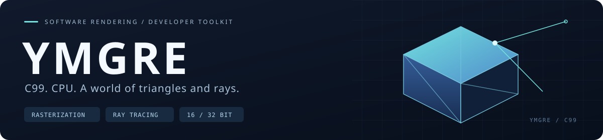
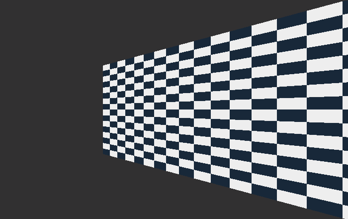
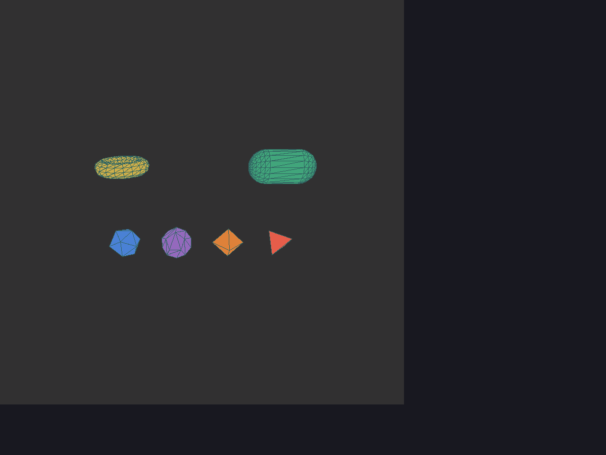

<p align="center"><strong>下载库，链接它，开始绘制三维场景。</strong></p>
<p align="center">C99 · CPU Rendering · uint16 / uint32 索引 · RGB565 / RGB888</p>

<p align="center"><a href="手册.md">使用手册</a> · <a href="examples/">Demo 源码</a> · <a href="BUILD_INFO.json">构建配置</a> · <a href="verification/">验收记录</a></p>

| 镜面反射 | 玻璃折射 |
|:---:|:---:|
|  |  |

| 透视校正贴图 | 法线贴图 |
|:---:|:---:|
|  |  |

| 光追阴影 | 基础几何与线框 |
|:---:|:---:|
|  |  |

<details>
<summary><strong>查看圆环、胶囊与多面体 Demo</strong></summary>



运行 `demo_extended_shapes` 查看这些几何；需要外部 YMGUI SDK 提供窗口显示。

</details>

*图片为窗口 Demo 的实际渲染输出。显示层使用外部 YMGUI/SDL；本包不捆绑它们的头文件或静态库。*

## 包里有什么

**四份核心静态库、一套公开头文件、一本使用手册、30 个 Demo 源码。**
核心包含几何生成、相机与裁剪、光栅化、材质光照、光追求交/着色函数及场景资源管理。

| 路径 | 用途 |
|---|---|
| `lib/libymgre_rgb565_index16.a` | RGB565，16 位索引（默认） |
| `lib/libymgre_rgb565_index32.a` | RGB565，32 位索引 |
| `lib/libymgre_rgb888_index16.a` | RGB888，16 位索引 |
| `lib/libymgre_rgb888_index32.a` | RGB888，32 位索引 |
| `include/YMGRE/` | 和库匹配的公开头文件 |
| `cmake/` | 自动选择位宽和依赖的 CMake 配置 |
| `examples/` | 无窗口示例、29 个窗口 Demo 和应用侧 `host` 接入代码 |
| `bin/rgb565/index16/`、`index32/` 及 `bin/rgb888/index16/`、`index32/` | 可直接运行的无窗口示例 |
| `手册.md` | 调用流程、API 导航、内存约定、Demo 分类和平台说明 |

当前二进制目标为 **Linux x86_64 / Release / RGB565 + RGB888**。核心只需要 C 标准库和 `libm`。
MCU 使用相同接口，但需按目标芯片和工具链另行构建库。

## 一分钟开始

解压后进入本目录：

```sh
./build_demos.sh 16
./examples-build/rgb565/index16/bin/demo_sdk_minimal
```

示例会生成 `cube.ppm` 并输出 `PASS`。无需引擎源码、YMGUI 或 SDL。
默认 RGB565 / index16。四种组合分别构建：

```sh
./build_demos.sh 16 --depth 16
./build_demos.sh 32 --depth 16
./build_demos.sh 16 --depth 24
./build_demos.sh 32 --depth 24
```

产物位于 `examples-build/rgb565/index16/` 等对应目录，四种配置互不混用。

## 在自己的工程里使用

```cmake
cmake_minimum_required(VERSION 3.16)
project(my_demo C)
set(CMAKE_C_STANDARD 99)
find_package(YMGRE CONFIG REQUIRED)
add_executable(my_demo main.c)
target_link_libraries(my_demo PRIVATE YMGRE::ymgre)
```

```sh
cmake -S . -B build \
  -DYMGRE_DIR=/absolute/path/YMGRE_libs/cmake \
  -DYMGRE_INDEX_BITS=16 -DYMGRE_CAMERA_COLOR_DEPTH=16
cmake --build build
```

把 [`examples/demo_sdk_minimal.c`](examples/demo_sdk_minimal.c) 作为第一个 `main.c` 即可。
导入目标会自动设置头文件、索引位宽、选定色深和数学库；应用不编译任何引擎实现。

## 窗口 Demo 与 YMGUI

YMGRE 和 YMGUI 分开发布。准备独立的 YMGUI SDK 后：

```sh
./build_demos.sh 16 /absolute/path/YMGUI_libs/cmake
./examples-build/rgb565/index16/bin/demo_basic_shapes
./examples-build/rgb565/index16/bin/demo_advanced_raytrace_mirror
# RGB888 + index32 窗口示例
./build_demos.sh 32 /absolute/path/YMGUI_libs/cmake --depth 24
```

外部包需要匹配架构、选中的色深，以及提供兼容的 CMake 目标。包接口约定和完整 Demo 导航见 [使用手册](手册.md)。
未提供外部包时只构建无窗口示例，不会自动寻找或编译仓库里的 YMGUI 源码。

## 配置、验证与版本

- 16 位库保留单子网格 65535 顶点上限；32 位库仍受 `int` 计数、内存和具体算法约束。
- 切换配置或升级版本时，库与头文件一起更新并重新编译应用。
- `BUILD_INFO.json` 记录构建平台、编译器和源码摘要；`verification/` 保存本次验收结果。
- 在本目录运行 `sha256sum -c checksums.sha256` 可验证文件完整性。
- 场景编辑器、UV 编辑和烘焙生成器是应用层工具，不包含在这四份核心库中。

维护库时在原仓库运行 `./sdk/build.sh` 生成本地包，使用 `./sdk/build.sh --release` 验证并更新 `releases/` 下的分发压缩包和校验文件。可追加 `--ymgui-dir /absolute/path/YMGUI_libs/cmake` 验证窗口示例，`--jobs 8` 调整并行度。构建或验收失败保留上一份 SDK 和分发包，脚本不会自动提交或推送；下载本包进行 Demo 开发不需要发布脚本。

## 授权声明

个人及非商业组织以非营利目的学习、研究或自用 YMGRE，可免费使用；商业用途必须事先说明并取得著作权人的书面授权。对外分发修改版或使用修改版对外提供服务时，须按许可条款公开本库的对应源码及必要构建文件。独立应用不因仅调用或链接本库而必须公开业务代码。第三方资源及外部依赖按各自原许可使用。完整条款见 [LICENSE](LICENSE)，同一份许可也保存在 [licenses/YMGRE-LICENSE](licenses/YMGRE-LICENSE)。

许可标识：`LicenseRef-YMGRE-Noncommercial-1.2`。本声明不撤回使用者依据此前有效许可已经取得的权利。

## 可裁剪材质功能

全功能 SDK 包含透明、透明 Mip、逐像素 PBR、线性色彩和可选多核调度。源码仓库运行 `./sdk/build.sh --minimal` 可生成五项材质能力和 PNG/JPEG 解码均关闭的 SDK，仍输出到 `build/YMGRE_libs`。源码 CMake 可通过 `YMGRE_ENABLE_TRANSPARENCY`、`YMGRE_ENABLE_OPACITY_MIPMAP`、`YMGRE_ENABLE_PBR`、`YMGRE_ENABLE_LINEAR_COLOR`、`YMGRE_ENABLE_RASTER_DISPATCH` 分别配置。预编译包的具体能力记录在 `BUILD_INFO.json`，CMake 会传播正确的公共宏并拒绝不一致的配置。更新时须一起替换头文件和库、重新编译应用。

材质对比 demo 源码和独立 CMake 工程位于 `examples/girl_viewer`，链接完整 SDK，支持 T 切换单／多线程。大体积人物资源仅随源码仓库保存，使用 `--assets` 指向源码仓库的 `Resource/girl` 目录，详见该目录 README。

完整 SDK 还支持 PNG/JPEG 贴图，需安装 libpng（含 zlib）及 libjpeg 的开发／运行依赖。CMake 自动传递依赖；手动链接需加 png、jpeg、z。`YMGRE_ENABLE_PNG`、`YMGRE_ENABLE_JPEG` 可独立裁剪，源码默认关闭，`--minimal` 同时关闭。详见 [图片加载说明](docs/image-loading.md)。
