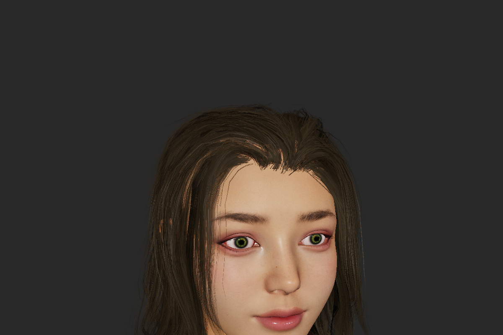

# Girl 查看器

直接链接正式 YMGRE，默认逐像素 GGX、线性色彩、按材质双面、透明图和 Mip。默认使用最多 16 个工作线程，线程数不超过系统报告的 CPU 数。库本身不依赖 SDL 或线程库，线程池只属于 demo。

## 实际效果

| 半身效果 | 脸部近景 |
|:---:|:---:|
|  |  |

来自当前示例的渲染缓冲，1200×800，仅做高质量 JPG 编码；未调色或修图。使用当前压缩后的 JPG/PNG 资源，未启用阴影或光追。截图不包含控制面板。

## 从仓库运行

模型、材质和贴图直接保存在 `Resource/girl`，无需 Python 或解压步骤。在仓库根目录执行：

```sh
./project_Demo/girl_viewer/build.sh
./build/bin/rgb888/index32/girl_viewer
# 或构建后直接打开：
./project_Demo/girl_viewer/build.sh --run
# 构建、运行核心测试和无窗口截图检查：
./project_Demo/girl_viewer/build.sh --test
```

`build/bin/rgb888/index32/` 与其他 Demo 共用，存放可执行文件，CMake 缓存和检查截图放在 `build/.cache/configs/rgb888/index32/project_Demo/girl_viewer/`。`--clean` 只清除此缓存后重建，`--jobs N` 调整编译并行数。完整目录说明见仓库 `docs/BUILD_LAYOUT.md`。

需要 CMake、C 编译器、libpng（含 zlib）、libjpeg、SDL2、SDL2_ttf 和 Linux NotoSansCJK 字体。仓库构建的可执行文件默认读取本仓库的 `Resource/girl`，从其他工作目录启动也可找到资源。也可通过 `--assets /path/to/Resource/girl` 指定位置。

文件直接存放在 girl 目录下：`.mesh` 网格、`.material` 材质、JPG 颜色／法线／MRS 图、PNG 透明图和 demo 使用的 `.pbr` 参数。颜色主要采用 JPEG 90，法线／MRS 采用 JPEG 95，均为 4:4:4、不降低分辨率；转换后比 JPG 更小的两张 MRS 保留 PNG。透明图无损保留，整套约 41.6 MiB。JPEG 有少量压缩误差。更新资源直接替换对应文件即可；`checksums.sha256` 记录当前文件校验值。资源来源仍为用户提供的模型，不因此变更其原有授权。

## 单独使用 SDK 构建

完整 SDK 附带 `examples/girl_viewer` 源码，不重复携带大体积人物资源。无需引擎源码：

```sh
cmake -S /path/to/YMGRE_libs/examples/girl_viewer -B build/.cache/sdk-girl \
  -DCMAKE_BUILD_TYPE=Release -DYMGRE_SDK_ROOT=/path/to/YMGRE_libs \
  -DYMGRE_PROGRAM_OUTPUT_DIR="$PWD/build/bin/rgb888/index32"
cmake --build build/.cache/sdk-girl -j4
build/bin/rgb888/index32/girl_viewer --assets /path/to/Resource/girl
```

精简 SDK 不包含所需渲染能力，配置时会明确拒绝。

## 操作和对比

1 双面策略，2 透明，3 透明 Mip，5 常用透明效果，6 材质，7 法线，8 线性色彩／RGB，9 逐像素／正式库原有顶点光照。0 恢复基础模式。A 转动，R 复位，F 全身，H 帽子，鼠标旋转／平移／缩放。

**T 在单线程与多线程之间切换**，面板显示实际 PBR 工作线程配置与渲染耗时。`--threads 1` 完全禁用线程池；`--threads 8` 指定数量（1～32）。顶点光照等非 PBR 场景自动走单线程路径；顶点回退不包含旧实验的顶点 GGX。

`--smoke-test --capture-dir DIR` 保存半身、近景、全身、RGB 和基础模式截图，检查单／多线程结果一致、模式恢复、反转提交顺序和近裁剪 HDR 数值。

`--benchmark` 输出默认 1200×800 下两轮、每轮 8 个固定旋转视角的 CPU 管线计时，预热不计入。比较线程数时保持资源、视角、分辨率与功能一致，并独占运行。多线程数据是整帧墙钟时间，不是单个工作线程 CPU 时间。仍为 CPU 光栅化，没有引入阴影或光追。
