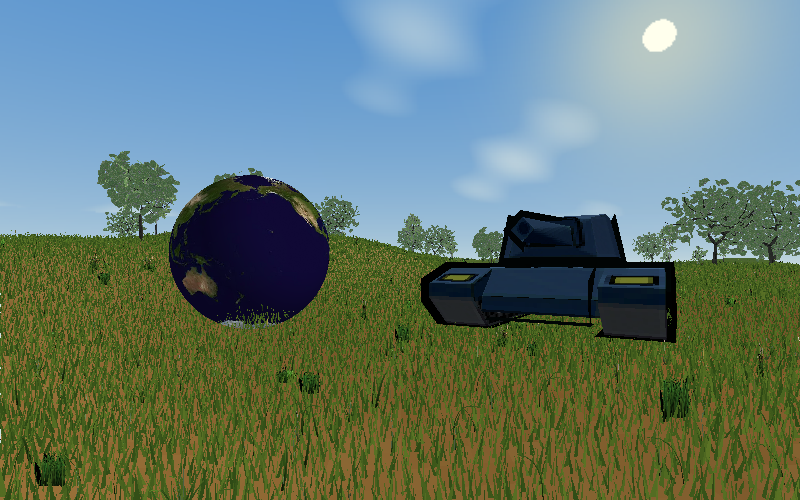

# Dense Grass · 草地、地球与坦克



独立的 RGB888 / index16、index32 桌面预览，使用 `Resource/vegetation_lowpoly`，不修改核心库和现有编辑器。

## 地形、植被与加载范围

- **地图维持 96 × 96**，没有扩大场地。257 × 257 高度图生成 65 × 65 顶点、8,192 个三角形，高度映射为 0–8 世界单位。
- **只向前延长加载范围**：在相机的水平朝向上，把原加载区域的前向长度从 21 拉长到 52.5（×2.5），侧向范围和后向范围保持原值。转动相机时加载区域一起转动；不再按固定 2.5 倍块数选择周围一整圈。
- **细草密度为 98 根/平方单位**，每块 1,568 根。初始视点加载 116 块、181,888 根；全图确定性布局共 903,168 根。细草保持本轮加密前的 1 倍；前方加载距离和地图面积不变。
- 每根短草是一个双面绘制的细长三角形，固定太阳照明预存在顶点色里。单个草块 4,704 顶点，适合两种索引位宽；编译期检查网格顶点数是否超限。
- **草丛密度提高 5 倍，全部 32 种保留**：全图 17,800 株，小模型每种 800 株、大型草丛每种 150 株。位置、角度和尺度记录固定，按 4 × 4 单位的空间块索引，先剔除整块，再处理块内实例。
- **草丛分级显示**：7 单位内加载原始网格；更远的草丛共享该模型预渲染的 8 个角度、64 × 64 缓存图。透明区域不写深度，实际草叶仍受前景遮挡，近远物体共用同一深度缓冲。相机转向时选择对应视图。缓存图使用固定太阳照明，远处形状和深度是近似表示。
- 初始视图筛选出 280 个草丛块，约 268 株使用完整模型，9,638 株使用缓存图。离开加载区域会释放完整网格；缓存图在各实例间共享，不为每株复制。
- **6 种整树、54 棵树**，每种 9 棵，是最初 18 棵的 3 倍。随机尺寸保持为原模型的 0.32–0.60，树冠包围范围之间额外留 0.7 单位空隙。全部 3 种枝叶模型仍作为树下散落物。
- **近处细草加载区保留黄土，远处未加载细草的地面直接使用绿色**。颜色随相机与细草覆盖范围更新，使用连续范围渐变而非按草块涂色。径向过渡宽度为加载判定坐标中的 4 单位，正前方随 2.5 倍拉伸约为 10 世界单位；侧后方还叠加方向边界渐变。共用一张 256 × 256 动态地面贴图，保留土色变化和近似树影。
- 出生点前方放置一个半径 2.1 的地球，使用 `Resource/地球贴图.bmp` 和平滑球面法线；完整坦克由 `Tank1_Body.mesh`、`Tank1_Head.mesh` 按原坐标组装，统一缩放与旋转。两者按地形高度落地，坦克保持刚体形状。
- 六面天空盒、太阳和光晕、薄雾。地面暗斑为近似树影，没有树干碰撞。当前仍属于软件渲染压力较大的视觉预览。

## 构建与运行

在仓库根目录一键编译并测试两个索引版本：

```bash
./project_Demo/nature_preview/build_both.sh
```

产物分别位于：

- `build/bin/rgb888/index16/nature_preview`
- `build/bin/rgb888/index32/nature_preview`

单独构建：

```bash
cmake -S project_Demo/nature_preview -B build/.cache/configs/rgb888/index32/project_Demo/nature_preview -DCMAKE_BUILD_TYPE=Release -DYMGRE_INDEX_BITS=32
cmake --build build/.cache/configs/rgb888/index32/project_Demo/nature_preview -j4
./build/bin/rgb888/index32/nature_preview
```

启动日志和窗口标题显示实际索引位宽。16 位索引限制针对单个网格，而非场景总顶点数；32 位不是性能优化手段。
WASD 移动，方向键转视角，Q/E 升降，R 复位，Esc 退出。相机跟随地形，最低离地 1.3 单位，画面分辨率 800 × 500。

## 高度图与资源

`assets/heightmap.pgm` 是实际地形数据，黑色对应 0，白色对应 8 世界单位。
运行 `python3 project_Demo/nature_preview/generate_heightmap.py` 可重新生成。
也可以把另一张无注释、257 × 257、8 位二进制 PGM 路径作为首个参数。
植被落点使用地形三角形插值。

完整资源列表见 `vegetation_catalog.h`；来源和许可见各模型目录的 README、manifest.json、SOURCE_LICENSE.html。

### 地球与坦克

| 物体 | 资源与几何 | 场景参数 |
| --- | --- | --- |
| 地球 | `Resource/地球贴图.bmp`；经纬球面 32 × 64 分段，2,145 顶点、3,968 个三角形，使用径向平滑法线 | 水平位置 `(4.1, -16)`，半径 2.1 |
| 坦克 | `Resource/obj/Tank1_Body.mesh`、`Tank1_Head.mesh`，同目录 `.material` 和 `Tank_1.BMP` | 水平位置 `(-4.1, -17)`，统一缩放 0.72，绕 Y 轴旋转 0.55 弧度 |

水平位置按 `(x, z)` 记。坦克车身和炮塔共用原始模型坐标，不分别居中，以保留装配关系。地球和坦克都根据网格顶点下方的地形高度求向上偏移，避免顶点穿地；坦克不随坡面倾斜，也没有履带贴地变形、运动或碰撞逻辑。凹凸地面下，刚体底部可能有局部空隙。

当前预览由代码构建，未保存成可供编辑器打开的 `.scene` 文件。近远地面颜色取决于细草加载范围，不是逐株草的精确覆盖遮罩。地球仅使用颜色贴图，本项目未加载地球高度图或法线贴图。

## 实现文件与调整入口

| 文件 | 职责 |
| --- | --- |
| `nature_preview.c` | 地形、植被布局、相机和天空；`updateGround` 更新黄绿地面，`addSceneProps` 组装地球与坦克 |
| `grass_impostor.c` / `.h` | 为每种草生成八方向缓存图，以及透明遮罩与深度绘制 |
| `vegetation_catalog.h` | 树、草丛和散落枝叶的完整资源目录 |
| `generate_heightmap.py` | 生成可复现的地形高度图 |
| `build_both.sh` | 分别构建 index16、index32，并执行 CTest |

地图尺寸、细草密度、树木数量、加载前向倍率和近处草丛网格距离位于 `nature_preview.c` 顶部宏定义。草丛数量同时受 `ACCENT_COUNT` 和实例生成处 `copies` 控制，调整时必须保持二者一致，初始化会校验总数。草丛分块和缓存渲染属于此 demo 的实现，尚未抽成核心库通用接口。

## 验证、性能与截图

```bash
YMGRE_HEADLESS=1 ./build/bin/rgb888/index32/nature_preview --smoke-test
YMGRE_HEADLESS=1 ./build/bin/rgb888/index32/nature_preview --benchmark
YMGRE_HEADLESS=1 YMGRE_MAX_FRAMES=2 YMGUI_SHOT=/tmp/meadow.bmp ./build/bin/rgb888/index32/nature_preview
```

Smoke 测试检查前向 2.5 倍边界、未扩大的左右/后向边界、镜头转向后的范围旋转，以及移动、切换远处再返回后的图像一致性；初始化校验植被总量、草种完整性、树冠间距。
Benchmark 连续前进 40 帧，分别报告全部帧与后续帧的绘制均值，包含草块/模型加载、渲染和大气效果，不包含窗口提交和帧间等待，并打印加载、材质网格、细草、大气、远景缓存五部分耗时。

`nature_grass_impostor_depth` 检查透明像素保留背景深度、前景遮挡和不同提交顺序下的画面一致性。两个索引版本都执行上述检查。

本机同一路径 40 帧测试：此前 3,560 株原始草、全部用网格，后续帧均值约 145.6 ms；现在 17,800 株、分块与分级显示，约 116.9 ms。32 种模型 × 8 视图的启动缓存生成约 28 ms。以上不代表其他硬件的固定性能保证。

### 2026-09-21 验证记录

- 将无细草覆盖的远景地面改为绿色，近处保留黄土，增加随视点变化的连续渐变；加入地球和完整坦克。
- index16、index32 均构建通过，两个版本各自的 `nature_preview_camera_smoke` 和 `nature_grass_impostor_depth` 均通过。
- 已检查 800 × 500 实际软件渲染截图，更新本页 `assets/preview.png`，并打开 index32 交互窗口查看。
- 同路线 40 帧基准：后续帧均值约 **118.2 ms**（此前未加物体与地面过渡约 116.9 ms），仍不是流畅帧率。分项均值：加载与地面更新 4.4 ms、材质网格 54.8 ms、细草 37.4 ms、大气 14.4 ms、远景草丛缓存 7.2 ms。
- 此轮自动测试覆盖既有加载、返回视图一致性与缓存图深度行为；物体外观和落地效果通过截图检查，未新增物理接触测试。
